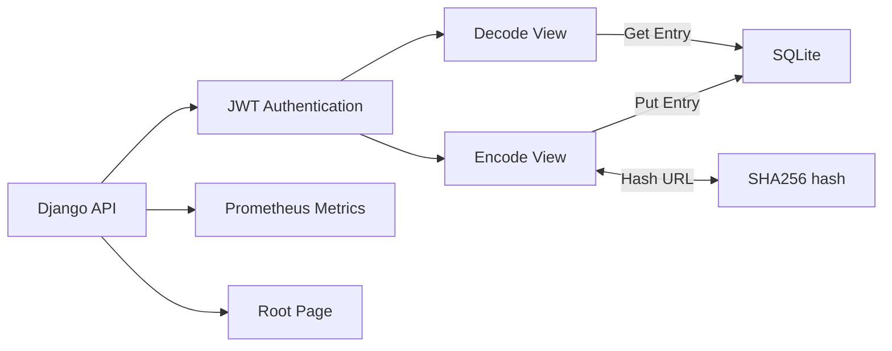

# Overview

This project is an API that shortens a URL. It takes in a long URL and shortens in the format of https://short.est/GeAi9K. This was done using Python and Django.

# Problem

The problem was given by Yello. The goal was to design an efficient, observable, and stable service that shortens urls.

# Requirements

| Requirement                                                      | Priority |
| ---------------------------------------------------------------- | -------- |
| Encode endpoint which encodes the url to a shortened one         | P0       |
| Decode endpoint which decodes a shortened url to the original    | P0       |
| Implement endpoints with json responses                          | P0       |
| Persist endpoints in a database                                  | P1       |
| Authenticate Users with JWT                                      | P1       |
| Use environment variables (e.g. base url, django secret)         | P1       |
| Metrics generation for observability                             | P2       |
| Containerize application for easier deployment                   | P2       |
 
## Out of Scope

- Any User Interface is out of scope. This is purely intended to function just as an API.
- CI/CD necessary to deploy the application
- Security Auditing to ensure that the application is fully safe

## Success Criteria

Success is defined as a fully functioning API that contains a base structure to be built off of. Ideally, this API could be containerized with proper CI/CD, be deployed, and function as expected.

Additionally, success criteria could also be defined as passing this stage of the interview ;).

# Architecture
The application is made with Django, and follows many of the coding conventions of Django. At it's core the design is quite simple.



## API Design

### GET /

Returns a welcome message.

#### Responses

- **200 OK**
  - Description: Welcome message
  - Content: `string`

### GET /metrics

Retrieves metrics for monitoring purposes using Prometheus.

#### Responses

- **200 OK**
  - Description: Metrics retrieved successfully
  - Content: Metrics data in Prometheus format

### POST /api/encode/

Encodes a URL.

#### Request Body

- **url** (string, required): Original URL to be encoded

#### Authentication

- Requires JWT authentication token in the request header.

#### Responses

- **200 OK**
  - Description: Encoded URL
  - Content:
    ```json
    {
      "shortened_url": "string"
    }
    ```
- **400 Bad Request**
  - Description: Invalid URL

### POST /api/decode/

Decodes a URL.

#### Request Body

- **url** (string, required): Encoded URL to be decoded

#### Authentication

- Requires JWT authentication token in the request header.

#### Responses

- **200 OK**
  - Description: Original URL
  - Content:
    ```json
    {
      "original_url": "string"
    }
    ```
- **400 Bad Request**
  - Description: Invalid URL
- **404 Not Found**
  - Description: Shortened URL not found

### POST /api/token/

Obtains a JWT token.

#### Request Body

- **username** (string, required): User's username
- **password** (string, required): User's password

#### Responses

- **200 OK**
  - Description: JWT token obtained successfully
  - Content:
    ```json
    {
      "access": "string",
      "refresh": "string"
    }
    ```
- **401 Unauthorized**
  - Description: Invalid username or password

### POST /api/token/refresh/

Refreshes a JWT token.

#### Request Body

- **refresh** (string, required): Refresh token

#### Responses

- **200 OK**
  - Description: JWT token refreshed successfully
  - Content:
    ```json
    {
      "access": "string"
    }
    ```
- **401 Unauthorized**
  - Description: Invalid refresh token

## Choice of Django
I chose Django for this project primarily because it is really easy to spin up a lot of default components quickly through the plugin architecture. For example, instead of fiddling with custom prometheus metrics, I am able to in a couple steps import the plugin, use the view, map my models, and call it a day.

Specifically these features were what drew me the most:
- Authentication 
  - I was able to just add a jwt plugin (`djangorestframework-simplejwt`), add a couple of annotations, and be up and running with authentication
- Automatic Admin Interface
  - Automatic admin access allowed the creation and deletion of users, as well as visibility into the project/database with ease. 
- Database ORM
  - The automatic integration with an sqlite database meant that I could be up and running with persistence really quickly. Trying to fiddle around with a database with time constraints would have been difficult.

## Data Model

The only model is `URLMapping` class which represents a pair of original and encoded urls.

### Attributes

- **original_url**: `URLField`
  - Description: The original URL.
  - Constraints: Unique
- **encoded_url**: `URLField`
  - Description: The encoded (shortened) version of the original URL.
  - Constraints: Unique

## Hashing Algorithm
First, I hash the url with SHA256 to create a unique hash. Then I encoded that hash with base64 to make sure that it is url safe. This way I can come up with a url safe hash for a shortlink. This combination seemed like the fastest and easiest way to create a unique hash.

# Testing and Observability

I utilized django (and `djangorestframework`) to write unit tests for all code in my application. Through this test-driven development, I am able to ensure that my logic is written correctly.

Additionally, I added Prometheus metrics to observe the following components:
- Metrics on database stats
- Metrics on `URLMapping` writes/reads
- Metrics on endpoint calls and status codes

Lastly, I implemented different logging levels (based on development/production stage) to ensure that I could get debugging output if necessary
